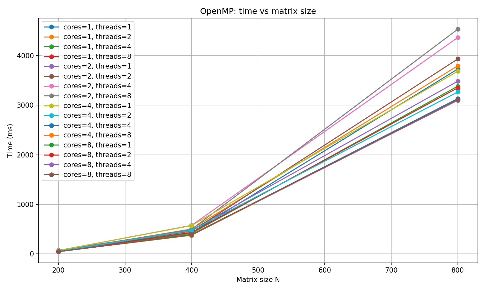
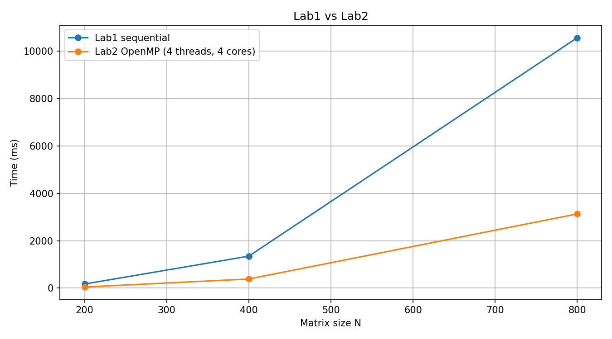

# Основы параллельных вычислений — Лабораторная работа 2
Выполинл:
Назаров Александр 6201-120305D

## Постановка задачи
Модифицировать программу из лабораторной работы №1 для параллельной работы по технологии OpenMP.

Нужно провести серию экспериментов:
- с разным количеством потоков: `1, 2, 4, 8`
- с разными размерами матриц: `200, 400, 800, 1200, 1600, 2000`
- с разным количеством вычислительных ядер: `1, 2, 4, 8`

## Структура проекта
- `matrixmult/matrixmult.cpp` — OpenMP-реализация умножения матриц.
- `matrixmult/matrixmult.vcxproj` — проект Visual Studio с включённым OpenMP.
- `scripts/matrix_generate.py` — генерация входных матриц.
- `scripts/run_openmp_experiments.py` — автоматический прогон серии экспериментов.
- `scripts/verify_matrix_mult.py` — проверка корректности результатов через NumPy.
- `scripts/plot_matrixmult_time.py` — график времени для серий OpenMP-экспериментов.
- `scripts/plot_lab1_vs_lab2.py` — сравнение последовательной версии из `lab1` и OpenMP-версии из `lab2`.
- `data/` — входные и выходные матрицы.
- `results/` — CSV с результатами экспериментов и итоговые графики.

## Требования
- Windows + Visual Studio (MSVC)
- Python 3
- Python-библиотеки:
  - `numpy`
  - `matplotlib`


## Сборка и запуск
1. Открыть `matrixmult/matrixmult.vcxproj` в Visual Studio.
2. Собрать проект, например `Debug | x64`.
3. Сгенерировать входные данные:

```bash
py -3 scripts/matrix_generate.py
```

4. Проверить одиночный запуск:

```bash
.\matrixmult\matrixmult.exe --threads 4 --cores 4 --sizes 200,400,800
```

5. Запустить серию экспериментов:

```bash
py -3 scripts/run_openmp_experiments.py
```

6. Построить график по результатам:

```bash
py -3 scripts/plot_matrixmult_time.py
```

7. Построить сравнение с лабораторной работой №1:

```bash
py -3 scripts/plot_lab1_vs_lab2.py
```

## Формат вывода программы
Для каждого размера матрицы программа выводит:
- размер матрицы `N`
- число потоков
- число ядер
- время выполнения в миллисекундах
- объём задачи `2 * N^3`

Пример:

```text
N=800 | Threads: 4 | Cores: 4 | Time: 3131 ms | Task volume: 1024000000 operations | Saved: data/C_800.txt
```

## Верификация
Проверка корректности выполняется скриптом:

```bash
py -3 scripts/verify_matrix_mult.py
```

Скрипт загружает `A_n`, `B_n`, `C_n` из папки `data/` и проверяет равенство:

```text
C_n == A_n @ B_n
```

## Результаты экспериментов
Файл `results/openmp_results.csv` содержит результаты серии запусков в формате:

```text
size,threads,cores,time_ms
200,1,1,49
400,1,1,431
800,1,1,3728
...
```

## Графики
### Зависимость времени от размера матрицы(Изменение ядер и потоков)



### Сравнение лабораторной работы №1 и №2



## Вывод
Параллельная версия на OpenMP позволяет уменьшить время вычислений по сравнению с последовательной реализацией из лабораторной работы №1, особенно на больших размерах матриц. Эффект ускорения зависит от числа потоков и числа доступных вычислительных ядер.
